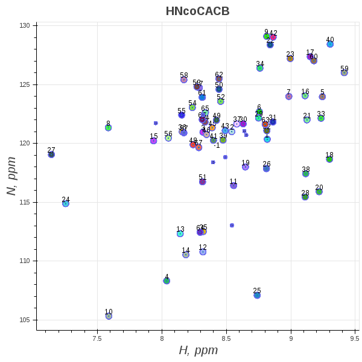

How to generate results using experimental peak lists
=====================================================

Command-line interface
----------------------

.. code:: bash

   ssc (Spin System Creator) command-line interface

   Usage:
       ssc -h | --help
       ssc --version
       ssc group (--plpath=<path>) (--plformat=<format>) (--stype=<type>)
                 (--dims=<labels>) (--rdims=<labels>)
                 [--crspath=<path>] [--result=<path>]
       ssc visualize <grouping_result> <x_idx> <y_idx> <x_label> <y_label> <plot_title>

   Options:
       -h, --help                   Show this screen.
       --version                    Show version.
       --verbose                    Print what files are processing.
       --plpath=<path>              Path to peak list.
       --plformat=<format>          Peak list format.
       --stype=<type>               Spectrum type.
       --dims=<labels>              Comma-separated dimension labels.
       --rdims=<labels>             Comma-separated root dimension labels.
       --crspath=<path>             Registration algorithm executable path
                                    [default: ssc/bin/CRS_EXE].
       --result=<path>              Path to directory where results will be saved.

Solution NMR peak lists
-----------------------

To generate results cd into ssc-0.1.0 and run `ssc` package providing
necessary command-line arguments:

.. code:: bash

   python3 -m ssc group --plpath=solution_nmr/sparky/bpti_HNcoCACB.txt \
                        --plformat=sparky --stype=HNcoCACB --dims=H,N,CA/CB --rdims=H,N \
                        --result=solution_nmr/sparky/grouping_results

.. code:: bash

   python3 -m ssc group --plpath=solution_nmr/sparky/csp_HNcoCACB.txt \
                        --plformat=sparky --stype=HNcoCACB --dims=H,N,CA/CB --rdims=H,N \
                        --result=solution_nmr/sparky/grouping_results

.. code:: bash

   python3 -m ssc group --plpath=solution_nmr/sparky/er14_HNcoCACB.txt \
                        --plformat=sparky --stype=HNcoCACB --dims=H,N,CA/CB --rdims=H,N \
                        --result=solution_nmr/sparky/grouping_results

.. code:: bash

   python3 -m ssc group --plpath=solution_nmr/sparky/fgf_HNcoCACB.txt \
                        --plformat=sparky --stype=HNcoCACB --dims=H,N,CA/CB --rdims=H,N \
                        --result=solution_nmr/sparky/grouping_results

.. code:: bash

   python3 -m ssc group --plpath=solution_nmr/sparky/jr19_HNcoCACB.txt \
                        --plformat=sparky --stype=HNcoCACB --dims=H,N,CA/CB --rdims=H,N \
                        --result=solution_nmr/sparky/grouping_results

.. code:: bash

   python3 -m ssc group --plpath=solution_nmr/sparky/ns1_HNcoCACB.txt \
                        --plformat=sparky --stype=HNcoCACB --dims=H,N,CA/CB --rdims=H,N \
                        --result=solution_nmr/sparky/grouping_results

.. code:: bash

   python3 -m ssc group --plpath=solution_nmr/sparky/rnaseC6572S_HNcoCACB.txt \
                        --plformat=sparky --stype=HNcoCACB --dims=H,N,CA/CB --rdims=H,N \
                        --result=solution_nmr/sparky/grouping_results

.. code:: bash

   python3 -m ssc group --plpath=solution_nmr/sparky/rnaseWT_HNcoCACB.txt \
                        --plformat=sparky --stype=HNcoCACB --dims=H,N,CA/CB --rdims=H,N \
                        --result=solution_nmr/sparky/grouping_results

.. code:: bash

   python3 -m ssc group --plpath=solution_nmr/sparky/zdom_HNcoCACB.txt \
                        --plformat=sparky --stype=HNcoCACB --dims=H,N,CA/CB --rdims=H,N \
                        --result=solution_nmr/sparky/grouping_results

.. code:: bash

   python3 -m ssc group --plpath=solution_nmr/sparky/zr18_HNcoCACB.txt \
                        --plformat=sparky --stype=HNcoCACB --dims=H,N,CA/CB --rdims=H,N \
                        --result=solution_nmr/sparky/grouping_results

The resulting grouping results file for each peak list should look like the following:

.. code-block:: json

   [
       {"label": 1, "stds":{"H": 0.0, "N": 0.0158831924200058}, "peaks": [
       {"assignment": ["F4H", "F4N", "D3CA"], "dimensions": [7.873, 116.548, 65.539], "index": 0},
       {"assignment": ["F4H", "F4N", "D3CB"], "dimensions": [7.873, 116.557, 47.949], "index": 1}]},

       {"label": 2, "stds":{"H": 0.0, "N": 0.0158831924200058}, "peaks": [
       {"assignment": ["C5H", "C5N", "F4CA"], "dimensions": [7.491, 121.177, 67.365], "index": 0},
       {"assignment": ["C5H", "C5N", "F4CB"], "dimensions": [7.491, 121.179, 45.58], "index": 1}]},

       {"label": 3, "stds":{"H": 0.0, "N": 0.0158831924200058}, "peaks": [
       {"assignment": ["L6H", "L6N", "C5CA"], "dimensions": [7.596, 113.784, 66.102], "index": 0},
       {"assignment": ["L6H", "L6N", "C5CB"], "dimensions": [7.596, 113.796, 47.736], "index": 1},

       {"label": 4, "stds":{"H": 0.0, "N": 0.0158831924200058}, "peaks": [
       {"assignment": ["E7H", "E7N", "L6CA"], "dimensions": [7.551, 120.464, 62.846], "index": 0},
       {"assignment": ["E7H", "E7N", "L6CB"], "dimensions": [7.551, 120.439, 49.795], "index": 1}]}
   ]

Solid-state NMR peak lists
--------------------------

To generate results cd into ssc-0.1.0 and run `ssc` package providing
necessary command-line arguments:

.. code:: bash

   python3 -m ssc group --plpath=solid_state_nmr/sparky/GB1_CANCOCX.txt \
                        --plformat=sparky --stype=CANCOCX --dims=CA,N,CO,CX --rdims=CA,N \
                        --result=solid_state_nmr/sparky/grouping_results

.. code:: bash

   python3 -m ssc group --plpath=solid_state_nmr/sparky/GB1_NCACX.txt \
                        --plformat=sparky --stype=NCACX --dims=N,CA,CX --rdims=N,CA \
                        --result=solid_state_nmr/sparky/grouping_results

.. code:: bash

   python3 -m ssc group --plpath=solid_state_nmr/sparky/GB1_NCOCX.txt \
                        --plformat=sparky --stype=NCOCX --dims=N,CO,CX --rdims=N,CO \
                        --result=solid_state_nmr/sparky/grouping_results

.. code:: bash

   python3 -m ssc group --plpath=solid_state_nmr/sparky/DsbB_NCACX.txt \
                        --plformat=sparky --stype=NCACX --dims=N,CA,CX --rdims=N,CA \
                        --result=solid_state_nmr/sparky/grouping_results

.. code:: bash

   python3 -m ssc group --plpath=solid_state_nmr/sparky/CAPgly_NCACX.txt \
                        --plformat=sparky --stype=NCACX --dims=CA,N,CX --rdims=CA,N \
                        --result=solid_state_nmr/sparky/grouping_results

.. code:: bash

   python3 -m ssc group --plpath=solid_state_nmr/sparky/CAPgly_NCOCX.txt \
                        --plformat=sparky --stype=NCOCX --dims=CO,N,CX --rdims=CO,N \
                        --result=solid_state_nmr/sparky/grouping_results

Similarly as with solution NMR peak lists, grouping results should look like the following:

.. code-block:: json

   [
       {"label": 1, "stds":{"CA": 0.0324434340000153, "N": 0.0268508233129978}, "peaks": [
       {"assignment": ["?", "?", "?", "?"], "dimensions": [54.255, 125.266, 175.992, 54.2], "index": 0},
       {"assignment": ["?", "?", "?", "?"], "dimensions": [54.264, 125.199, 174.263, 60.121], "index": 1},
       {"assignment": ["E19CA", "N", "T18C", "CB"], "dimensions": [54.238, 125.162, 171.561, 70.813], "index": 2},
       {"assignment": ["E19CA", "N", "T18C", "E19CB"], "dimensions": [54.265, 125.209, 171.582, 30.195], "index": 3},
       {"assignment": ["E19CA", "N", "T18C", "CA"], "dimensions": [54.265, 125.151, 171.582, 61.351], "index": 4}]},

       {"label": 2, "stds":{"CA": 0.0324434340000153, "N": 0.0268508233129978}, "peaks": [
       {"assignment": ["?", "?", "?", "?"], "dimensions": [57.094, 118.153, 179.251, 61.53], "index": 0},
       {"assignment": ["N35CA", "N", "A34C", "CA"], "dimensions": [57.014, 118.151, 179.776, 56.035], "index": 1},
       {"assignment": ["N35CA", "N", "A34C", "CB"], "dimensions": [56.998, 118.118, 179.783, 18.1], "index": 2},
       {"assignment": ["N35CA", "N", "A34C", "N35CB"], "dimensions": [56.981, 118.114, 179.748, 39.275], "index": 3}]},

       {"label": 3, "stds":{"CA": 0.0324434340000153, "N": 0.0268508233129978}, "peaks": [
       {"assignment": ["?", "?", "?", "?"], "dimensions": [46.923, 108.354, 176.194, 55.925], "index": 0},
       {"assignment": ["G38CA", "N", "N37C", "CA"], "dimensions": [46.884, 108.384, 174.413, 53.493], "index": 1},
       {"assignment": ["G38CA", "N", "N37C", "CB"], "dimensions": [46.887, 108.346, 174.408, 40.38], "index": 2},
       {"assignment": ["G38CA", "N", "N37C", "G38CA"], "dimensions": [46.835, 108.325, 174.317, 46.851], "index": 3}]}
   ]

Visualize grouping result files
-------------------------------

.. code:: bash

   python3 -m ssc visualize solution_nmr/grouping_results/jr19_HNcoCACB.txt_grouping_result.json 0 1 H N HNcoCACB

The html file will be produced which will contain interactive plot displaying spin system clusters where
individual clusters can be examined. The following is the example of generated plot:

